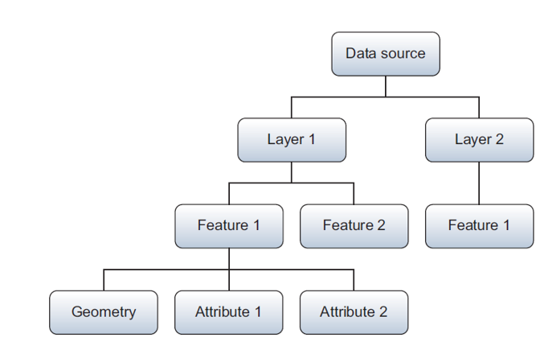
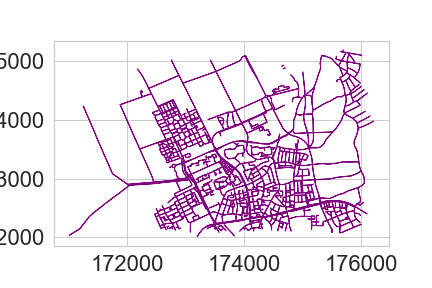

# [WUR Geoscripting](https://geoscripting-wur.github.io/) 

# Week 3, Lesson 10: Vector data handling with Python

_Jan Verbesselt, Jorge Mendes de Jesus, Aldo Bergsma, Dainius Masiliunas, David Swinkels, Judith Verstegen, Corné Vreugdenhil_ - `r format(Sys.time(), '%Y-%m-%d')`

## Introduction

Good morning! Today we will explore a variety of Python packages for vector data handling:

* [GDAL](https://gdal.org/api/python.html), the backbone of spatial data processing in Python (and R) with high performance
* [Shapely](http://toblerity.org/shapely/) for geometric operations
* [GeoPandas](http://geopandas.org/) for exploratory vector data analysis, based on [Pandas](http://pandas.pydata.org/) for dataframes and data analysis
* [pyproj](https://github.com/jswhit/pyproj) for re-projecting
* [Fiona](http://toblerity.org/fiona/) for geodata access and conversions
* [psycopg2](https://pypi.org/project/psycopg2/) for PostgreSQL database connection
* [GeoPy](https://geopy.readthedocs.io/en/stable/) for geocoding


## Setting up the Python Environment
First, the Python environment needs to be setup, as you learned in the previous lesson. Check what environments are already available:

```{r, eval=FALSE,engine='bash'}
conda info --envs
```

We can use the existing 'geoscripting' environment. If you don't have it yet/anymore, create it with the bash scripts below. 

```{r, eval=FALSE, engine='bash'}
wget https://raw.githubusercontent.com/GeoScripting-WUR/InstallLinuxScript/master/user/environment.yml
conda env create -f environment.yml
```

Then, activate the environment. See the previous lesson if you do not remember how to do that.

Finally, make a folder structure for this tutorial, and open Spyder as you IDE:

```{r, eval=FALSE,engine='bash'}
cd ~/Documents/
mkdir PythonVector #or give the directory a name to your liking
cd ./PythonVector
mkdir scripts
mkdir data
mkdir output
spyder
```


## Vector Geometries

<!-- GDAL, potentially add 
At the backbone of spatial data processing in Python is GDAL. GDAL means Geospatial Data Abstraction Library, it is a ‘translator library’ for raster and vector geospatial data. Although the overarching package is called GDAL, the term is mostly used for the raster handling part. The vector handling part of the GDAL package is called OGR.

In this tutorial, we will not work much with OGR separately. However, it is at the basis of many other packages. Therefore, to understand object structures in these packages, it is convenient to know how various objects in OGR are related to each other:
* When you open a file (e.g. shapefile), you have a DataSource object
* A Data source can have one or more Layer objects
* A Layer can have one or more Feature objects
* Features have Geometry and Attribute objects


--> 

WKT ([Well Known Text](https://en.wikipedia.org/wiki/Well-known_text)) is a markup language that describes spatial information in a clean text format. WKT can represent the following distinct (OGC-defined) vector objects:

* Geometry primitives (single entity, basic types):
    * Point
    * Line (formally known as a LineString)
    * Polygon
* Multipart geometries, homogeneous entity collections:
    * Multi-Point
    * Multi-Line (MultiLineString)
    * Multi-Polygon
* GeometryCollection:
    * A combination of any of the above
* Other, less used objects

Geometric objects in any Python package (e.g. GDAL, shapely) are usually based on the geometries that can be represented in WKT strings. As such, it is useful to know how to write geometries in WKT; then you do not need to learn the specific way of each individual Python package. GDAL (OGR) example:

```{Python, eval=FALSE}
from osgeo import ogr

# Here, define the WKT string
wktstring = "POINT (1120351.5712494177 741921.4223245403)"
# Transform to a gdal (ogr) object
point = ogr.CreateGeometryFromWkt(wktstring)
# Get properties
print(type(point))
print("%d,%d" % (point.GetX(), point.GetY()))
```

Shapely example, from WKT or make the Point object directly:

```{Python, eval=FALSE}
from shapely.geometry import Point
from shapely.wkt import loads

# Create point from WKT string 
wktstring = 'POINT(173994.1578792833 444133.6032947102)'
wageningen_campus = loads(wktstring)
print(type(wageningen_campus))

# Point directly
wageningen_campus = Point([173994.1578792833, 444133.60329471016])
print(type(wageningen_campus))
```

There is an equivalent in binary format called WKB, easier for computers to process and more efficient for data transfer.

```{block, type="alert alert-success"}
> **Question 1**: What does WKB mean? (hint: think about WKT)
```


## Geopandas: GeoSeries and GeoDataFrames

GeoPandas strives to make vector processing in Python easier and has many functions available for exploratory vector data analysis. GeoPandas is based on Pandas. Pandas has two main data structures: the Pandas Series and the DataFrame. Correspondingly, Geopandas has two main data structures: the GeoSeries and the GeoDataFrame. 

A GeoSeries is a vector of features, where each feature contains: 1) an index, and 2) a geometry. The latter is a shapely.geometry object, and therefore inherits attributes and methods from shapely geometries, such as area, bounds, distance, etc. Finally, a GeoSeries can contain a coordinate reference system (crs). Geopandas functions, such as buffering, can be applied to GeoSeries:

```{Python, eval=FALSE}
import geopandas as gpd
from shapely.wkt import loads

# Define a point
wktstring = 'POINT(173994.1578792833 444133.6032947102)'
# Convert to a GeoSeries
gs = gpd.GeoSeries([loads(wktstring)])
print(type(gs), len(gs))
# Specify the projection
gs.crs = "EPSG:28992" 
# Apply function, here a buffer of 100 m
gs_buffer = gs.buffer(100)
print(gs.geometry)
print(gs_buffer.geometry)
```

A GeoDataFrame is a tabular data structure with multiple columns, where one column is a GeoSeries. GeoDataFrames can be loaded from a file, created with data or loaded from a Pandas dataframe. A Pandas DataFrame is, just like the structured numpy array you learned about in lesson 9. a dataframe equivalent of R in Python.

A Pandas DataFrame plus a list of shapely geometries can be converted into a GeoSeries or directly to a GeoDataFrame.

```{Python, eval=FALSE}
import pandas as pd

# Create some data, with three points, a, b, and c.
data = {'name': ['a', 'b', 'c'],
        'x': [173994.1578792833, 173974.1578792833, 173910.1578792833],
        'y': [444135.6032947102, 444186.6032947102, 444111.6032947102]}
# Turn the data into a Pandas DataFrame, column names are extracted automatically
df = pd.DataFrame(data)
print(df.head)

# Use the coordinates to make shapely Point geometries
geometry = [Point(xy) for xy in zip(df['x'], df['y'])]
# Pandas DataFrame and shapely Points can together become a GeoPandas GeoDataFrame
wageningenGDF = gpd.GeoDataFrame(df, geometry=geometry, crs = "EPSG:28992") # note that we here specify the CRS (projection) directly while reading to GDF
print(type(wageningenGDF), len(wageningenGDF))
```


```{block, type="alert alert-success"}
> **Question 2**: What is the difference between a GeoSeries and a GeoDataFrame?
```


Geopandas provides a high-level interface to the matplotlib library (see previous lesson) for visualization. Vector data can simply be mapped by using the plot() method on a GeoSeries or GeoDataFrame. Several other arguments to customize the plot can still be used.

```{Python, eval=FALSE}
from matplotlib import pyplot as plt
# plotting a map of the GeoDataFrame directly
wageningenGDF.plot(marker='*', color='green', markersize=50)

```


<!-- This part has been removed in 2021/2022 to make space for more explanation on geometries
## Geocoding

Geocoding is the practice of locating the coordinates of addresses, cities, countries, and landmarks across the globe. Python has GeoPy to perform geocoding. GeoPy has a lot of [geocoders available](https://geopy.readthedocs.io/en/stable/) from Bing, Google, HERE, TomTom, MapBox and others. Often you need to have an API key to use the geocoders, which is used by the provider to limit the amount of requests to be able to keep the geocoding service running for everyone. Some geocoders are publicly available, such as Nominatim. Nominatim is made and used by OpenStreetMap. Paste the code below in Spyder and run the geocoder:

```{Python, eval=FALSE}
from geopy.geocoders import Nominatim
geolocator = Nominatim(user_agent="specify_random_user_agent")
location = geolocator.geocode("Wageningen University")
print((location.latitude, location.longitude))
# It should print two coordinates: (lat: 51.98527485, lon:5.66370505205543)
```

Try to locate the coordinates of your own house. -->

## Re-projecting

<!-- 
From the geocoder you got a latitude and longitude. On the web it is very common to use latitude and longitude in [WGS84 geographic coordinate system](http://spatialreference.org/ref/epsg/wgs-84). In local projects often projected coordinate systems are required to perform accurate geometric calculations. PyProj reprojects your coordinates from any input projection to an output projection. Use PyProj to do a simple conversion on a coordinate pair:

```{Python, eval=FALSE}
from pyproj import Transformer
geolocator = Nominatim(user_agent="specify_random_user_agent")
location = geolocator.geocode("Wageningen University")
x, y = Transformer.from_crs(4326, 28992).transform(location.latitude, location.longitude) #mind swap in axis order!
print([x, y]) # always inspect results of your data handling, in this case double-check the coordinates due to potential swap in axis order.

```
-->
 
An important step in the pre-processing of geodata is to get all datasets in a projection that suits the analysis to be performed. GeoPandas uses PyProj in the backend to reproject the geometry of the dataframe. Reproject a GeoDataFrame from Dutch RD New (EPSG:28992) to WGS84 (EPSG:4326):

```{Python, eval=FALSE}
data = {'name': ['a', 'b', 'c'],
        'x': [173994.1578792833, 173974.1578792833, 173910.1578792833],
        'y': [444135.6032947102, 444186.6032947102, 444111.6032947102]}
df = pd.DataFrame(data)
geometry = [Point(xy) for xy in zip(df['x'], df['y'])]
wageningenGDF = gpd.GeoDataFrame(df, geometry=geometry)
print(wageningenGDF.crs)
wageningenGDF.crs = 'EPSG:28992'
print(wageningenGDF.crs)
wageningenGDF = wageningenGDF.to_crs('EPSG:4326')
print(wageningenGDF.crs)
```

## Writing and Reading Files

GeoPandas uses Fiona for file access, while Fiona, in its turn, builds on GDAL/OGR. You can find out what file formats Fiona supports with a simple script.

```{Python, eval=FALSE}
import fiona
print(fiona.supported_drivers)
```

Fiona has drivers for:

* Open formats such as GeoJSON and GPX
* ESRI formats such as shapefiles and OpenFileGDB
* Other formats such as MapInfo and DGN

But Fiona lacks some other popular file formats:

* Open formats such as [KML](https://github.com/Toblerity/Fiona/issues/97) or [GML](https://github.com/Toblerity/Fiona/pull/96) based on the XML format. Solution: [xml.etree.ElementTree](https://docs.python.org/3/library/xml.etree.elementtree.html).
* Databases such as PostgreSQL. Solution: [psycopg2](https://pypi.org/project/psycopg2/).
* Webservices such as Web Feature Service [WFS] or Web Map Service [WMS]. Solution: [OWSLib](https://geopython.github.io/OWSLib/).
* Columnar formats, such as CSV or xls. Solution: Pandas can read [csv](https://pandas.pydata.org/pandas-docs/stable/generated/pandas.read_csv.html) or [excel](https://pandas.pydata.org/pandas-docs/stable/generated/pandas.read_excel.html) columns.

If none of these packages are helpful to access your files, [OGR might still be able to help](http://www.gdal.org/ogr_formats.html).

A GeoDataFrame can be written directly to a GeoJSON file or a shapefile. [GeoJSON is a recommended format](http://switchfromshapefile.org/) to use for geographic data in WGS84 coordinate system since JSON dictionaries are easy to read and use on the web, and GeoJSON is supported in popular GIS software. [GeoJSON](http://geojson.org/) is a standard format to encode Geographic data structures in a dictionary. We assume that you are working in the main repository in which you have a data repository. Write some files to a GeoJSON and shapefile:

```{Python, eval=FALSE}
data = {'name': ['a', 'b', 'c'],
        'x': [173994.1578792833, 173974.1578792833, 173910.1578792833],
        'y': [444135.6032947102, 444186.6032947102, 444111.6032947102]}
# Create a Pandas DataFrame (is not yet a GeoDataFrame!)
df = pd.DataFrame(data)
# Loop over each x,y combination and convert to a Shapely point
geometry = [Point(xy) for xy in zip(df['x'], df['y'])]
# Add the geometries to the DataFrame and thereby make it into a GeoDataFrame
wageningenGDF = gpd.GeoDataFrame(df, geometry=geometry)
# Save to disk
wageningenGDF.to_file(filename='./data/wageningenPOI.geojson', driver='GeoJSON')
wageningenGDF.to_file(filename='./data/wageningenPOI.shp', driver='ESRI Shapefile')
```

Reading files is just as intuitive:

```{Python, eval=FALSE}
jsonGDF = gpd.read_file('./data/wageningenPOI.geojson')
shpGDF = gpd.read_file('./data/wageningenPOI.shp')
```

## Reading from Web Services

The web has a lot of geodata available. The OpenGeoSpatial Consortium has specified standard protocols for geo web services, such as [Web Feature Service](http://www.opengeospatial.org/standards/wfs) [WFS] and [Web Map Service](http://www.opengeospatial.org/standards/wms) [WMS]. The standard web service protocols make it easy to access data. For example, the following WFS provides geodata on roads and is extracted from the Dutch national database of roads in the Netherlands:

```{Python, eval=FALSE}
from owslib.wfs import WebFeatureService
WfsUrl = 'https://geodata.nationaalgeoregister.nl/nwbwegen/wfs?'
wfs = WebFeatureService(url=WfsUrl, version='2.0.0')
wfs.identification.title
print(list(wfs.contents))
```

WFS are useful to make webmaps, to quickly get an idea of the data and to make geodata accessible for all. If you want to do a large analysis, it is better to download the geodata from other available repositories and not from a WFS, as it typically has limits on the number of features that can be requested, such as 100 or 1000 features. In the WFS above, they are very generous with a limit of max 15.000 features per request.

Load some roads from the WFS service for the campus area and plot them:

```{Python, eval=FALSE}
import json
# x, y = (173994.1578792833, 444133.60329471016) #uncomment if you lost x, y coordinates or Nominatim didn't work above :D
WfsUrl = 'https://geodata.nationaalgeoregister.nl/nwbwegen/wfs?'
wfs = WebFeatureService(url=WfsUrl, version='2.0.0')
layer = list(wfs.contents)[0]
xmin, xmax, ymin, ymax = x-1000, x+350, y-1000, y+350
response = wfs.getfeature(typename=layer, bbox=(xmin, ymin, xmax, ymax))
with open('./data/Roads.gml', 'wb') as file:
    file.write(response.read())
roadsGDF = gpd.read_file('./data/Roads.gml')
print(type(roadsGDF))
roadsGDF.plot()
```


How many roads are there in the resulting GeoDataFrame (hint: _len()_ or _.info()_)? Do we miss roads in the extent?

Load some building from another WFS service (BAG) and plot them too. How many buildings do you get? (hint: _len()_) Do you miss buildings? How can we extract missing buildings in our extent?

```{Python, eval=FALSE}
from matplotlib import pyplot as plt
WfsUrl = 'https://geodata.nationaalgeoregister.nl/bag/wfs/v1_1'
wfs = WebFeatureService(url=WfsUrl, version='1.1.0')
layer = list(wfs.contents)[1]
xmin, xmax, ymin, ymax = x-500, x+500, y-500, y+500
response = wfs.getfeature(typename=layer, bbox=(xmin, ymin, xmax, ymax), outputFormat='json')
data = json.loads(response.read())
BuildingsGDF = gpd.GeoDataFrame.from_features(data['features'])
BuildingsGDF.crs = 28992 # Set crs to RD New
print(type(BuildingsGDF))
roadlayer = roadsGDF.plot(color='grey')
roadlayer.set_xlim(xmin, xmax)
roadlayer.set_ylim(ymin, ymax)
# Plotting the map
BuildingsGDF.plot(ax=roadlayer, color='red')
# Save to disk
plt.savefig('./output/BuildingsAndRoads.png')
```


## Selecting Data

GeoDataFrames store rows and columns in a tabular format. To select specific rows, you can make use of the DataFrame functionality of Pandas. Inspect the content of your data:

```{Python, eval=FALSE}
print(BuildingsGDF.columns)
print(BuildingsGDF.head())
print(BuildingsGDF.area)
```

Then based on the surface area, select buildings with a larger surface area of 1000 m2 with the .loc method. This is equivalent to selecting rows.

```{Python, eval=FALSE}
print(BuildingsGDF.area > 1000)
largeBuildingsGDF = BuildingsGDF.loc[BuildingsGDF.area > 1000, :]
largeBuildingsGDF.plot()
```

Columns can be selected by using an index to the name of the column. Let us here the construction years ('bouwjaar') of the buildings.

```{Python, eval=FALSE}
print(BuildingsGDF['bouwjaar'])

```

Specific rows can be selected by using .isin method on a series. Here we select buildings that are still to be build (status = in construction ('Bouw gestart')).

```{Python, eval=FALSE}
print(BuildingsGDF['status'].isin(['Bouw gestart']))
NewBuildingsGDF = BuildingsGDF[BuildingsGDF['status'].isin(['Bouw gestart'])]
## plot the new buildings with a basemap for reference
## based on https://geopandas.org/gallery/plotting_basemap_background.html
import contextily as ctx
NewBuildingsGDF = NewBuildingsGDF.to_crs(epsg=3857)
ax = NewBuildingsGDF.plot(figsize=(10, 10), alpha=0.5, edgecolor='k')
ctx.add_basemap(ax, source=ctx.providers.Stamen.TonerLite)
ax.set_axis_off()
```


## Geometric Manipulations

GeoDataFrames and GeoSeries have several [constructive methods](http://geopandas.org/geometric_manipulations.html) to modify the geometry: buffer, boundary, centroid, convex hull, envelope, simplify, unary union, rotate, scale, skew and translate. When modifying the geometries in the DataFrames, it is a good practice to keep track of your geometry types and your geometry data. Have a look at the geometry types of the roads.

```{Python, eval=FALSE}
print(type(roadsGDF))
print(type(roadsGDF.geometry))
print(roadsGDF['geometry'])
```

Let's create a buffer around the roads to represent coverage of roads, assuming roads have all a width of 3 meters.
```{Python, eval=FALSE}
RoadsPolygonGDF = gpd.GeoDataFrame(roadsGDF, geometry=roadsGDF.buffer(distance=1.5)) # buffer of 1.5 m on both sides
RoadsPolygonGDF.plot(color='blue', edgecolor='blue')
RoadsPolygonGDF.area.sum()# checkout the total coverage of roads
```

As we did a buffer around many lines that are connected, we might expect overlap of the roads polygon features. Lets merge all road polygon features together in a unary_union and check again for the total coverage of the roads.
```{Python, eval=FALSE}
RoadsUnionGS = gpd.GeoSeries(RoadsPolygonGDF.unary_union)
RoadsUnionGS.area
print('There was an overlap of ' + round((RoadsPolygonGDF.area.sum() - RoadsUnionGS.area[0]), 1).astype(str) + ' meters.')
```

```{block, type="alert alert-success"}
> **Question 3**: What is the geometry type of geometries in RoadsUnionGS?
```

```{block, type="alert alert-success"}
> **Question 4**: What coordinate system does RoadsUnionGS have?
```

GeoPandas can perform different [overlay operations](http://geopandas.org/set_operations.html): intersection, union, symmetrical difference and difference. Clip the roads with convexed parcels by using intersection. As an example, let us focus on the area around the new buildings on the campus and extract the existing roads close to them. To do so we buffer the new buildings with 100 meter, merge them with a unary_union and create a convex hull around the merged (multipolygon) buildings. Finally we clip the roads with this.
```{Python, eval=FALSE}
NewBuildingsGDF = NewBuildingsGDF.to_crs(epsg=28992)
AreaOfInterestGS = gpd.GeoSeries(NewBuildingsGDF.buffer(distance=100).unary_union)
AreaOfInterestGDF = gpd.GeoDataFrame(AreaOfInterestGS.convex_hull)
AreaOfInterestGDF = AreaOfInterestGDF.rename(columns={0:'geometry'}).set_geometry('geometry')
AreaOfInterestGDF.crs = 'EPSG:28992'
#AreaOfInterestGDF.plot()
## perform an intersection overlay
roadsIntersectionGDF = gpd.overlay(AreaOfInterestGDF, RoadsPolygonGDF, how="intersection")
#roadsIntersectionGDF.plot(color='blue', edgecolor='blue')
## plot the results
roadlayer = roadsIntersectionGDF.plot(color='grey', edgecolor='grey')
roadlayer.set_xlim(xmin, xmax)
roadlayer.set_ylim(ymin, ymax)
NewBuildingsGDF.plot(ax=roadlayer, color='red')
```


The big advantage of GeoPandas is that GeoPandas allows both geometric and dataframe manipulations. For example, GeoPandas can select the roads within (and maintained by) Wageningen Municipality and calculate total road surface area.

```{Python, eval=FALSE}
WageningenRoadsGDF = RoadsPolygonGDF.loc[RoadsPolygonGDF['gme_naam']=='Wageningen']
print(sum(WageningenRoadsGDF.area))
WageningenRoadsGDF.plot(edgecolor='purple')
```



## Visualizing spatial information

There are multiple solutions to visualize your geodata: GIS software (QGIS), web platforms (leaflet/Folium) and images (matplotlib).

Folium uses leaflet on the backend to make webmaps. With leaflet your geodata can be easily visualized inside a webpage. [Leaflet](https://leafletjs.com/) is the leading open-source JavaScript library for mobile-friendly interactive maps. Folium handles GeoDataFrames or JSON files as input for the interactive map. The Python script below makes a .html file in your working directory, which you can open in your preferred web browser:

```{Python, eval=FALSE}
import folium
campusMap = folium.Map([location.latitude, location.longitude], zoom_start=17)
BuildingsGDF.crs = 'EPSG:28992'
BuildingsGDF = BuildingsGDF.to_crs(4326)
RoadsPolygonGDF = RoadsPolygonGDF.to_crs(4326)
campusMap.choropleth(BuildingsGDF, name='Building construction years',
                     data=BuildingsGDF, columns=['gid', 'bouwjaar'],
                     key_on='feature.properties.gid', fill_color='RdYlGn',
                     fill_opacity=0.7, line_opacity=0.2,legend_name='Construction year')
campusMap.choropleth(RoadsPolygonGDF, name='Roads')
folium.LayerControl().add_to(campusMap)
campusMap.save('./output/campusMap.html')
campusMap
```
```{block, type="alert alert-info"}
> **Tip**: If you are using Spyder, you can view the interactive map by opening the html file that has been generated (`./output/campusMap.html`). If you are running in the Jupyter Notebook, the interactive map should automatically show.
```


Matplotlib allows you to make good quality maps for reports or publications.

```{Python, eval=FALSE}
import geopandas as gpd
from owslib.wfs import WebFeatureService
from matplotlib import pyplot as plt
# extract only buildings on and around WUR campus
WfsUrl = 'https://geodata.nationaalgeoregister.nl/bag/wfs/v1_1'
wfs = WebFeatureService(url=WfsUrl, version='1.1.0')
layer = list(wfs.contents)[1]
xmin, xmax, ymin, ymax = x-300, x+600, y-300, y+300
response = wfs.getfeature(typename=layer, bbox=(xmin, ymin, xmax, ymax), outputFormat='json')
data = json.loads(response.read())
BuildingsGDF = gpd.GeoDataFrame.from_features(data['features'], crs=28992)
# create visualization
f, ax = plt.subplots(1, figsize=(10, 5))
# Give the plot a title (do not do this for a scientific report, rather use a caption)
ax.set_title('WUR campus buildings')
# Backgroundcolor of the map
ax.set_facecolor("grey")
# The plotting itself, of the roads
roadlayer = RoadsPolygonGDF.plot(ax=ax, legend=True)
# Set the range of the x and y axis
roadlayer.set_xlim(xmin, xmax)
roadlayer.set_ylim(ymin, ymax)
# Add the buildings to the matplotlib axes with already plotted roads
buildingslayer = BuildingsGDF.plot(ax=roadlayer, column='bouwjaar',
                                   cmap='brg', #see https://matplotlib.org/3.1.0/tutorials/colors/colormaps.html
                                   legend=True,
                                   legend_kwds={'label': "Construction year",'orientation': "vertical"})
```


## Network analysis

[OSMnx](https://osmnx.readthedocs.io/en/stable/) retrieves, constructs, analyzes and visualizes street networks from [OpenStreetMap](https://www.openstreetmap.org/search?query=Wageningen%20university#map=18/51.98528/5.66368). In short, a network analysis is investigating structures of relations between entities with the use of networks and graph theory. In spatial data, such entities are typically animals or people, and the relations between are, for example, social networks. But relations can also be between multiple points in time for the same person, e.g. movement processes like walking, cycling, driving et cetera. 

The following script downloads the street network of Wageningen from Open Street Map as a graph, plots it, and saves it.

```{Python, eval=FALSE}
import osmnx as ox
city = ox.geocoder.geocode_to_gdf('Wageningen, Netherlands')
ox.plot.plot_footprints(ox.project_gdf(city))
WageningenRoadsGraph = ox.graph.graph_from_place('Wageningen, Netherlands', network_type='bike')
ox.plot.plot_graph(WageningenRoadsGraph, figsize=(10,10), node_size=2)
ox.io.save_graph_shapefile(G=WageningenRoadsGraph, filepath='OSMnetwork_Wageningen.shp')
gdf_nodes, gdf_edges = ox.graph_to_gdfs(G=WageningenRoadsGraph)
print(gdf_nodes.info())
print(gdf_edges.info())
```


OSMnx can store the downloaded street network (the Graph) as a shapefile or as a GeoDataFrame. Furthermore, the main purpose is to perform a network analysis, such as a shortest path from source to target location. Let us calculate the shortest path from Wageningen campus to Wageningen city center. Is this the route you would take?

```{Python, eval=FALSE}
source = ox.distance.get_nearest_node(WageningenRoadsGraph, (51.987817, 5.665779))
target = ox.distance.get_nearest_node(WageningenRoadsGraph, (51.964870, 5.662409))
shortestroute = ox.distance.shortest_path(G=WageningenRoadsGraph,
                                    orig=source, dest=target, weight='length')
ox.plot.plot_graph_route(WageningenRoadsGraph, shortestroute, figsize=(20,20),
                         route_alpha=0.6, route_color='darkred',
                         route_linewidth=10, orig_dest_size=100)
```


# What have we learned?

1. The structure of vector geometries, 
2. Creating GeoPandas GeoSeries and GeoDataFrames
3. Re-projecting
4. Reading and writing data
5. Reading webservices
6. Selecting data
7. Geometric manipulations
8. Geo-visualization
9. Network analysis

# More info
- [Geo-Spatial Notebooks](https://github.com/jupyter/jupyter/wiki/A-gallery-of-interesting-Jupyter-Notebooks#earth-science-and-geo-spatial-data)
- [Geo Python course](https://geo-python.github.io)
- [GDAL tutorials](https://gdal.org/api/python.html#tutorials)
