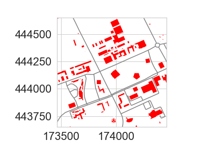
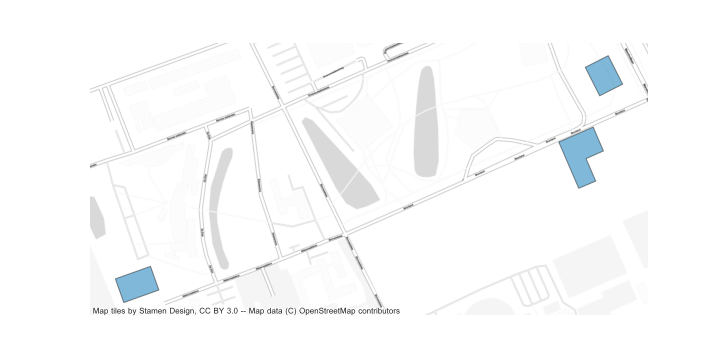

<style type="text/css">
body {max-width: none;}
a:visited {color: #91170a;}
</style>

# [WUR Geoscripting](https://geoscripting-wur.github.io/) 

# Vector data handling with Python

## Introduction

Today we will explore a variety of Python packages for vector data handling:

* [GDAL](https://pypi.org/project/GDAL/), the backbone of spatial data processing in Python (and R) with high performance
* [Shapely](https://shapely.readthedocs.io/en/stable/) for geometric operations
* [GeoPandas](http://geopandas.org/) for exploratory vector data analysis, based on [Pandas](http://pandas.pydata.org/) for dataframes and data analysis
* [pyproj](https://github.com/jswhit/pyproj) for re-projecting
* [Fiona](https://fiona.readthedocs.io/en/latest/) for geodata access and conversions
* [osmnx](https://osmnx.readthedocs.io/en/stable/) for network analysis 

## Learning objectives

- Know how to create a point dataset in Python
- Be able to write spatial vector formats to disk
- Be able to read spatial vector formats from web services and files
- Know how to apply basic operations on vector data, such as buffers and shortest-path algorithms
- Be able to plot spatial vector data with Matplotlib

## Setting up the Python Environment

Make a directory structure for this tutorial:

```{r, eval=FALSE,engine='bash'}
cd ~/Documents/
mkdir PythonVector #or give the directory a name to your liking
cd ./PythonVector
mkdir data
mkdir output
```

The conda environment we are using today contains more (and larger) packages than yesterday, but the process we use to create and activate it is the same. Create a text file, (re)name it (to) `vector.yaml`, and copy the following content into the file:

```
name: vector
dependencies:
  - python
  - numpy
  - matplotlib
  - spyder
  - gdal
  - shapely
  - pandas
  - geopandas
  - fiona
  - owslib
  - folium
  - osmnx
  - contextily
  - geodatasets
```

Now, create the environment with:

```{r, eval=FALSE,engine='bash'}
mamba env create --file vector.yaml
```

Activate the environment, open Spyder, create a script in the root directory and start coding.

# Vector Geometries and Python

At the backbone of spatial data processing in Python is GDAL. GDAL means Geospatial Data Abstraction Library, it is a ‘translator library’ for raster and vector geospatial data. Although the overarching package is called GDAL, the term is mostly used for the raster handling part. The vector handling part of the GDAL package is called OGR.

In this tutorial, we will not work much with OGR separately. However, it is at the basis of many other packages. Therefore, to understand object structures in these packages, it is convenient to know how various objects in OGR are related to each other:

* When you open a file (e.g. shapefile), you have a DataSource object
* A Data source can have one or more Layer objects
* A Layer can have one or more Feature objects
* Features have Geometry and Attribute objects


WKT ([Well Known Text](https://en.wikipedia.org/wiki/Well-known_text)) is a markup language that describes spatial information in a clean text format. WKT can represent the following distinct (OGC-defined) vector objects:

* Geometry primitives (single entity, basic types):
    * Point
    * Line (formally known as a LineString)
    * Polygon
* Multipart geometries, homogeneous entity collections:
    * Multi-Point
    * Multi-Line (MultiLineString)
    * Multi-Polygon
* GeometryCollection:
    * A combination of any of the above
* Other, less used objects

Geometric objects in any Python package (e.g. GDAL, shapely) are usually based on the geometries that can be represented in WKT strings. As such, it is useful to know how to write geometries in WKT; then you do not need to learn the specific way of each individual Python package. GDAL (OGR) example:

```{Python, eval=FALSE}
from osgeo import ogr

# Define the WKT string
wktstring = "POINT (1120351.5712494177 741921.4223245403)"

# Transform to a GDAL (OGR) object
point = ogr.CreateGeometryFromWkt(wktstring)

# Get properties
print(type(point))
print("%d,%d" % (point.GetX(), point.GetY()))
```

A Shapely example, where we create a point from WKT or make the Point object directly:

```{Python, eval=FALSE}
from shapely.geometry import Point
from shapely.wkt import loads

# Create point from WKT string 
wktstring = 'POINT(173994.1578792833 444133.6032947102)'
wageningen_campus = loads(wktstring)
print(type(wageningen_campus))

# Point directly
wageningen_campus = Point([173994.1578792833, 444133.60329471016])
print(type(wageningen_campus))
```

There is an equivalent in binary format called WKB, easier for computers to process and more efficient for data transfer.

```{block, type="alert alert-success"}
> **Question 1**: What does WKB mean? (hint: think about WKT)
```

# Geopandas: GeoSeries and GeoDataFrames

GeoPandas strives to make vector processing in Python easier and has many functions available for exploratory vector data analysis. GeoPandas is based on Pandas. Pandas has two main data structures: the `Series` and the `DataFrame`. Correspondingly, GeoPandas has two main data structures: the `GeoSeries` and the `GeoDataFrame`. 

A `GeoSeries` is a vector of features, where each feature contains: 1) an index, and 2) a geometry. The latter is a `shapely.geometry` object, and therefore inherits attributes and methods from shapely geometries, such as area, bounds, distance, etc. Finally, a `GeoSeries` can contain a coordinate reference system (crs). GeoPandas functions, such as buffering, can be applied to `GeoSeries`:

```{Python, eval=FALSE}
import geopandas as gpd
from shapely.wkt import loads

# Define a point
wktstring = 'POINT(173994.1578792833 444133.6032947102)'

# Convert to a GeoSeries
gs = gpd.GeoSeries([loads(wktstring)])

# Inspect the properties
print(type(gs), len(gs))

# Specify the projection
gs.crs = "EPSG:28992" 

# We can now apply a function
# As an example, we add a buffer of 100 m
gs_buffer = gs.buffer(100)

# Inspect the results
print(gs.geometry)
print(gs_buffer.geometry)
```

A `GeoDataFrame` is a tabular data structure with multiple columns, where one column is a `GeoSeries`. `GeoDataFrames` can be loaded from a file, created with data or loaded from a Pandas `DataFrame`. A Pandas `DataFrame` is, just like the structured NumPy array you learned about in the previous tutorial, a dataframe equivalent of R in Python. Note that a `GeoSeries` is thus an equivalent to a `geometry` column/vector in R.

A Pandas `DataFrame` plus a list of shapely geometries can be converted into a `GeoSeries` or directly to a `GeoDataFrame`. 

```{Python, eval=FALSE}
import pandas as pd

# Create some data, with three points, a, b, and c.
data = {'name': ['a', 'b', 'c'],
        'x': [173994.1578792833, 173974.1578792833, 173910.1578792833],
        'y': [444135.6032947102, 444186.6032947102, 444111.6032947102]}

# Turn the data into a Pandas DataFrame (column names are extracted automatically)
df = pd.DataFrame(data)

# Inspect the DataFrame
print(df.head)

# Use the coordinates to make shapely Point geometries
geometry = [Point(xy) for xy in zip(df['x'], df['y'])]

# Pandas DataFrame and shapely Points can together become a GeoPandas GeoDataFrame
# Note that we specify the CRS (projection) directly while creating a GDF
wageningenGDF = gpd.GeoDataFrame(df, geometry=geometry, crs="EPSG:28992") 

# Inspect wageningenGDF
print(type(wageningenGDF), len(wageningenGDF))
```


```{block, type="alert alert-success"}
> **Question 2**: What is the difference between a GeoSeries and a GeoDataFrame?
```

Geopandas provides a high-level interface to the Matplotlib library (see previous tutorial) for visualization. Vector data can simply be mapped by using the `plot()` method in a `GeoSeries` or `GeoDataFrame`. Several other arguments to customize the plot can still be used. Note that the aspect of the axes (see previous tutorial) is set to equal automatically when using Geopandas plot, i.e. the horizontal and vertical scale are automatically made the same.

```{Python, eval=FALSE}
from matplotlib import pyplot as plt

# Plotting a map of the GeoDataFrame directly
wageningenGDF.plot(marker='*', color='green', markersize=50)
```


<!-- This part has been removed in 2021/2022 to make space for more explanation on geometries
## Geocoding

Geocoding is the practice of locating the coordinates of addresses, cities, countries, and landmarks across the globe. Python has GeoPy to perform geocoding. GeoPy has a lot of [geocoders available](https://geopy.readthedocs.io/en/stable/) from Bing, Google, HERE, TomTom, MapBox and others. Often you need to have an API key to use the geocoders, which is used by the provider to limit the amount of requests to be able to keep the geocoding service running for everyone. Some geocoders are publicly available, such as Nominatim. Nominatim is made and used by OpenStreetMap. Paste the code below in Spyder and run the geocoder:

```{Python, eval=FALSE}
from geopy.geocoders import Nominatim
geolocator = Nominatim(user_agent="specify_random_user_agent")
location = geolocator.geocode("Wageningen University")
print((location.latitude, location.longitude))
# It should print two coordinates: (lat: 51.98527485, lon:5.66370505205543)
```

Try to locate the coordinates of your own house. -->

# Re-projecting

<!-- 
From the geocoder you got a latitude and longitude. On the web it is very common to use latitude and longitude in [WGS84 geographic coordinate system](http://spatialreference.org/ref/epsg/wgs-84). In local projects often projected coordinate systems are required to perform accurate geometric calculations. PyProj reprojects your coordinates from any input projection to an output projection. Use PyProj to do a simple conversion on a coordinate pair:

```{Python, eval=FALSE}
from pyproj import Transformer
geolocator = Nominatim(user_agent="specify_random_user_agent")
location = geolocator.geocode("Wageningen University")
x, y = Transformer.from_crs(4326, 28992).transform(location.latitude, location.longitude) #mind swap in axis order!
print([x, y]) # always inspect results of your data handling, in this case double-check the coordinates due to potential swap in axis order.

```
-->
 
An important step in the pre-processing of geodata is to get all datasets in a projection that suits the analysis to be performed. GeoPandas uses PyProj in the backend to reproject the geometry of the GeoDataFrame. Here is an example of how to reproject the `wageningenGDF` `GeoDataFrame` we created earlier from Dutch RD New (EPSG:28992) to WGS84 (EPSG:4326):

```{Python, eval=FALSE}
# Check the current crs
print(wageningenGDF.crs)

# Re-project the points to WGS84
wageningenGDF = wageningenGDF.to_crs('EPSG:4326')

# Check the crs again to see if the changes were succesful
print(wageningenGDF.crs)
```

# Writing and Reading Files

GeoPandas uses [pyogrio](https://pyogrio.readthedocs.io/en/latest/) for file reading and writing files, while pyogrio, in its turn, builds on GDAL/OGR. Pygrio has drivers for most spatial datatypes, for example:

* Open formats such as GeoJSON and GPX
* ESRI formats such as shapefiles and OpenFileGDB
* Other formats such as MapInfo and DGN

In some cases, especially when connection external data sources such as webservices or databases Geopandas needs an external library to handle this connection, like OwsLib for webservices or Psycopg2 (or alternative) for databases. If none of these packages are helpful to access your files, [OGR might still be able to help](http://www.gdal.org/ogr_formats.html).

A `GeoDataFrame` can be written directly to a GeoJSON file or a shapefile. [GeoJSON is a recommended format](http://switchfromshapefile.org/) to use for geographic data in WGS84 coordinate system since JSON dictionaries are easy to read and use on the web, and GeoJSON is supported in popular GIS software. [GeoJSON](http://geojson.org/) is a standard format to encode Geographic data structures in a dictionary. We assume that you are working in the main repository in which you have a data repository. Write some files to a GeoJSON and shapefile:

```{Python, eval=FALSE}
# Save to disk
wageningenGDF.to_file(filename='data/wageningenPOI.geojson', driver='GeoJSON')
wageningenGDF.to_file(filename='data/wageningenPOI.shp', driver='ESRI Shapefile')
```

Reading files is just as intuitive:

```{Python, eval=FALSE}
# Read from disk
jsonGDF = gpd.read_file('data/wageningenPOI.geojson')
shpGDF = gpd.read_file('data/wageningenPOI.shp')
```

# Reading from webservices

The web has a lot of geodata available. The Open GeoSpatial Consortium ([OGC](https://www.ogc.org/)) has specified standard protocols for geo-webservices, such as [Web Feature Service](http://www.opengeospatial.org/standards/wfs) (WFS) and [Web Map Service](http://www.opengeospatial.org/standards/wms) (WMS). The standard web service protocols make it easy to access data. For example, the following WFS provides data from the central bureau of statistics, containing statistics about each postal code and is provided by the Dutch Kadaster:

```{Python, eval=FALSE}
from owslib.wfs import WebFeatureService

# Put the WFS url in a variable
wfsUrl = 'https://service.pdok.nl/cbs/postcode6/2022/wfs/v1_0?'

# Create a WFS object
wfs = WebFeatureService(url=wfsUrl, version='2.0.0')

# Get the title from the object
print(wfs.identification.title)

# Check the contents of the WFS
print(list(wfs.contents))
```

```{block, type="alert alert-success"}
> **Question 3**: How many feature sets does this WFS contain?
```

WFS give access to data in vector format and allow a quick view of the data making geodata accessible for everyone. If you want to do a large analysis, it is better to download geodata from other available repositories and not from a WFS, as it typically has limits on the number of features that can be requested, such as 100 or 1000 features. In the WFS above, they are very generous with a limit of max 15.000 features per request.

Load some postal code geometries from the WFS service for the campus area and plot them:

```{Python, eval=FALSE}
# Define center point and create bbox for study area
x, y = (173994.1578792833, 444133.60329471016)
xmin, xmax, ymin, ymax = x - 1000, x + 350, y - 1000, y + 350

# Get the features for the study area (using the wfs from the previous code block)
response = wfs.getfeature(typename=list(wfs.contents)[0], bbox=(xmin, ymin, xmax, ymax))

# Save them to disk
with open('data/postal_codes.gml', 'wb') as file:
    file.write(response.read())

# Read again with GeoPandas
pc_gdf = gpd.read_file('data/postal_codes.gml')

# Inspect and plot to get a quick view
print(type(pc_gdf))
pc_gdf.plot()
plt.show()
```


```{block, type="alert alert-success"}
> **Question 4**: How many roads are there in the resulting GeoDataFrame (hint: _len()_ or _.info()_)? Do we miss roads in the extent?
```

Now let's load some buildings from another WFS service (BAG) and plot them too. 

```{Python, eval=FALSE}
import json

# Get the WFS of the BAG
wfsUrl = 'https://service.pdok.nl/lv/bag/wfs/v2_0'
wfs = WebFeatureService(url=wfsUrl, version='2.0.0')
layer = list(wfs.contents)[0]

# Define center point and create bbox for study area
x, y = (173994.1578792833, 444133.60329471016)
xmin, xmax, ymin, ymax = x - 500, x + 500, y - 500, y + 500

# Get the features for the study area
# notice that we now get them as json, in contrast to before
response = wfs.getfeature(typename=layer, bbox=(xmin, ymin, xmax, ymax), outputFormat='json')
data = json.loads(response.read())

# Create GeoDataFrame, without saving first
buildingsGDF = gpd.GeoDataFrame.from_features(data['features'])

# Set crs to RD New
buildingsGDF.crs = 28992

# Plot roads and buildings together
pc_layer = pc_gdf.plot(color='grey')
buildingsGDF.plot(ax=pc_layer, color='red')

# Set the limits of the x and y axis
pc_layer.set_xlim(xmin, xmax)
pc_layer.set_ylim(ymin, ymax)

# Save the figure to disk
plt.savefig('./output/postalcoades_roads.png')
```



```{block, type="alert alert-success"}
> **Question 5**: How many buildings do you get? (hint: _len()_) Do you miss buildings? How can we extract missing buildings in our extent?
```

# Selecting data

GeoDataFrames store rows and columns in a tabular format. To select specific rows, you can make use of the DataFrame functionality of Pandas. Inspect the content of your data:

```{Python, eval=FALSE}
# Pandas function that returns the column labels of the DataFrame
print(buildingsGDF.columns)

# Pandas function that returns the first n rows, default n = 5
print(buildingsGDF.head())

# shape area (in the units of the projection)
print(buildingsGDF.area)
```

Columns can be selected using the name of the column. Let us take a look at the construction year ('bouwjaar') of the buildings.

```{Python, eval=FALSE}
# Inspect building year column
print(buildingsGDF['bouwjaar'])
```

For selecting rows, GeoPandas inherits the pandas methods for selecting data: label based indexing with `loc`, and integer position based indexing with `iloc`, which apply to both `GeoSeries` and `GeoDataFrame` objects. For more information on indexing/selecting, see the [pandas documentation](https://pandas.pydata.org/pandas-docs/stable/user_guide/indexing.html). In addition to these, GeoPandas provides coordinate based indexing with the `cx` indexer, which slices using a bounding box. 

Let us select buildings (rows) with a larger surface area than 1000 m2 with the `.loc` method.

```{Python, eval=FALSE}
# Inspect first
print(buildingsGDF.area > 1000)

# Make the selection, select all rows with area > 1000 m2, and all columns
# Using 'label based' indexing with loc, here with a Boolean array
largeBuildingsGDF = buildingsGDF.loc[buildingsGDF.area > 1000, :]

# Plot
largeBuildingsGDF.plot()
```

When selecting rows based on a conditional rule we can ask pandas to check whether a value from a row is equal to a value. In the example below we select the rows where the buildings are not in use. We do this by checking where the state ('status' in Dutch) is not equal (!=) to in use ('Pand in gebruik'). This returns a boolean array, which we can use to select rows. All rows where this array returns True are selected and the False rows are discarded. 

```{Python, eval=FALSE}
# Inspect first
print( buildingsGDF['status'] != 'Pand in gebruik' )

# Make the selection, the list of required values can contain more than one item
newBuildingsGDF = buildingsGDF[buildingsGDF['status'] != 'Pand in gebruik']

# Plot the new buildings with a basemap for reference
# based on https://geopandas.org/gallery/plotting_basemap_background.html
import contextily as ctx

# Re-project
newBuildingsGDF = newBuildingsGDF.to_crs(epsg=3857)

# Plot with 50% transparency
ax = newBuildingsGDF.plot(figsize=(10, 10), alpha=0.5, edgecolor='k')
ctx.add_basemap(ax, source=ctx.providers.OpenStreetMap.Mapnik, zoom=17)
ax.set_axis_off()
```



(Figures shown here and in the next section may differ slightly from the ones you obtain.)

# Geometric manipulations

GeoDataFrames and GeoSeries have several [constructive methods](http://geopandas.org/geometric_manipulations.html) to modify the geometry: buffer, boundary, centroid, convex hull, envelope, simplify, unary union, rotate, scale, skew and translate. When modifying the geometries in the DataFrames, it is a good practice to keep track of your geometry types and your geometry data. Have a look at the geometry types of the rivers.

```{Python, eval=FALSE}
# We will use a sample data library called geodatasets
import geodatasets

# For this example we will look at the european rivers
riversGDF = gpd.read_file(geodatasets.get_path('eea.large_rivers'))
rivers_GDF = riversGDF.to_crs(3857)


print(type(riversGDF))
print(type(riversGDF))
print(riversGDF['geometry'])
```

Let's create a buffer around the rivers to represent coverage of roads, assuming roads have all a width of 1000 meters.

```{Python, eval=FALSE}
# Buffer of 1.5 m on both sides
riversbufferGDF = gpd.GeoDataFrame(riversGDF, geometry=riversGDF(distance=500)) 

# Plot
roadsPolygonGDF.plot(color='blue', edgecolor='blue')

# Check the total coverage of buffers
print(roadsPolygonGDF.area.sum())
```

As we created buffers around many connected lines, we expect overlap of these buffer features. Therefore, let us merge all road buffer (polygon) features together in a `unary_union` and check again for the total coverage of buffers.

```{Python, eval=FALSE}
# Apply unary_union
# This returns a geometry, which we convert to a GeoSeries to be able to apply GeoPandas methods again
roadsUnionGS = gpd.GeoSeries(roadsPolygonGDF.unary_union)

# Check the new total coverage of buffers and compute the overlap
print(roadsUnionGS.area)
print('There was an overlap of ' + round((roadsPolygonGDF.area.sum() - roadsUnionGS.area[0]), 1).astype(str) + ' square meters.')
```

```{block, type="alert alert-success"}
> **Question 6**: What is the geometry type in RoadsUnionGS?
```

```{block, type="alert alert-success"}
> **Question 7**: What coordinate system does RoadsUnionGS have?
```

GeoPandas can perform various [overlay operations](http://geopandas.org/set_operations.html): intersection, union, symmetrical difference and difference. We will clip the roads with convexed parcels by using intersection. As an example, let us focus on the area around the new buildings on the campus and extract the existing roads close to them. To do so we buffer the new buildings with 100 meter, merge them with a `unary_union` and create a convex hull around the merged (multipolygon) buildings. Finally we clip the roads with this single polygon.
```{Python, eval=FALSE}
# Re-project
newBuildingsGDF = newBuildingsGDF.to_crs(epsg=28992)

# Buffer, returns geometry, convert to GeoSeries
areaOfInterestGS = gpd.GeoSeries(newBuildingsGDF.buffer(distance=100).unary_union)

# Convex hull, returns a GeoSeries of geometries, convert to GeoDataFrame
areaOfInterestGDF = gpd.GeoDataFrame(areaOfInterestGS.convex_hull)

# Adapt metadata
areaOfInterestGDF = areaOfInterestGDF.rename(columns={0:'geometry'}).set_geometry('geometry')
areaOfInterestGDF.crs = 'EPSG:28992'

# Perform an intersection overlay
roadsIntersectionGDF = gpd.overlay(areaOfInterestGDF, roadsPolygonGDF, how="intersection")

# Plot the results
roadlayer = roadsIntersectionGDF.plot(color='grey', edgecolor='grey')
roadlayer.set_xlim(xmin, xmax)
roadlayer.set_ylim(ymin, ymax)
newBuildingsGDF.plot(ax=roadlayer, color='red')
```


In summary, the advantage of GeoPandas is that it allows both geometric and dataframe manipulations/selections. As a result, GeoPandas can for example select the roads within a set bounding box **and** within (and maintained by) Wageningen Municipality.

```{Python, eval=FALSE}
# Put the WFS url in a variable
wfsUrl = 'https://geodata.nationaalgeoregister.nl/nwbwegen/wfs?'

# Create a WFS object
wfs = WebFeatureService(url=wfsUrl, version='2.0.0')

# Let's create a bit bigger bounding box for this example than last time
x, y = (173994.1578792833, 444133.60329471016)
xmin, xmax, ymin, ymax = x - 3000, x + 3000, y - 3000, y + 3000

# Get the features for the study area
response = wfs.getfeature(typename=list(wfs.contents)[0], bbox=(xmin, ymin, xmax, ymax))
roadsGDF = gpd.read_file(response)

# Select the roads within Wageningen municipality
wageningenRoadsGDF = roadsGDF.loc[roadsGDF['gme_naam'] == 'Wageningen']

# Plot
wageningenRoadsGDF.plot(edgecolor='purple')
```


# Network analysis

[OSMnx](https://osmnx.readthedocs.io/en/stable/) retrieves, constructs, analyzes and visualizes street networks from [OpenStreetMap](https://www.openstreetmap.org/search?query=Wageningen%20university#map=18/51.98528/5.66368). In short, a network analysis is investigating structures of relations between entities with the use of networks and graph theory. In spatial data, such entities are typically animals or people, and the relations between them, for example social networks. But relations can also be between multiple points in time for the same person, e.g. movement processes like walking, cycling, and driving. 

The following script downloads the street network of Wageningen from Open Street Map as a graph, plots it, and saves it.

```{Python, eval=FALSE}
import osmnx as ox

# Using a geocoder to get the extent
city = ox.geocoder.geocode_to_gdf('Wageningen, Netherlands')
ox.plot.plot_footprints(ox.project_gdf(city))

# Get bike network and create graph
wageningenRoadsGraph = ox.graph.graph_from_place('Wageningen, Netherlands', network_type='bike')

# Plot and save
ox.plot.plot_graph(wageningenRoadsGraph, figsize=(10, 10), node_size=2)
ox.io.save_graph_shapefile(G=wageningenRoadsGraph, filepath='data/OSMnetwork_Wageningen.shp')

# Metadata
gdf_nodes, gdf_edges = ox.graph_to_gdfs(G=wageningenRoadsGraph)
print(gdf_nodes.info())
print(gdf_edges.info())
```


OSMnx can store the downloaded street network (the Graph) as a shapefile or as a `GeoDataFrame`. Furthermore, the main purpose of the module is to perform network analyses, such as a shortest path from source to target location. Let us calculate the shortest path from Wageningen campus to Wageningen city center. Is this the route you would take?

```{Python, eval=FALSE}
# Origin
source = ox.distance.nearest_nodes(wageningenRoadsGraph, 5.665779, 51.987817)

# Destination
target = ox.distance.nearest_nodes(wageningenRoadsGraph, 5.662409, 51.964870)

# Compute shortest path 
shortestroute = ox.distance.shortest_path(G=wageningenRoadsGraph, orig=source, 
                                          dest=target, weight='length')

# Plot
ox.plot.plot_graph_route(wageningenRoadsGraph, shortestroute, figsize=(20, 20), 
                         route_alpha=0.6, route_color='darkred',  bgcolor='white', 
                         node_color='darkgrey', edge_color='darkgrey',
                         route_linewidth=10, orig_dest_size=100)
```


# Interactive visualization

There are multiple options to visualize your geodata: GIS software (QGIS), web maps (leaflet/Folium) and images (Matplotlib). We have already explored some of them previously during the tutorials, but here we will take a closer look at creating interactive web maps using Folium.

Folium uses leaflet on the backend to make web maps, easily visualized on a webpage. [Leaflet](https://leafletjs.com/) is an open-source JavaScript library for mobile-friendly interactive maps. Folium handles GeoDataFrames or JSON files as input for the interactive map. The Python script below makes a `.html` file in your working directory, which you can open in a [web browser](campusMap.html):

```{Python, eval=FALSE}
import folium

# Initialize the map
campusMap = folium.Map([51.98527485, 5.66370505205543], zoom_start=17)

# Re-project
buildingsGDF = buildingsGDF.to_crs(4326)
roadsPolygonGDF = roadsPolygonGDF.to_crs(4326)

# Add the buildings
folium.Choropleth(buildingsGDF, name='Building construction years',
                  data=buildingsGDF, columns=['identificatie', 'bouwjaar'],
                  key_on='feature.properties.identificatie', fill_color='RdYlGn',
                  fill_opacity=0.7, line_opacity=0.2,
                  legend_name='Construction year').add_to(campusMap)

# Add the roads
folium.GeoJson(roadsPolygonGDF).add_to(campusMap)

# Add layer control
folium.LayerControl().add_to(campusMap)

# Save (you can now open the generated .html file from the output directory)
campusMap.save('output/campusMap.html')
```

# More info
- [Geo-Spatial Notebooks](https://github.com/jupyter/jupyter/wiki/A-gallery-of-interesting-Jupyter-Notebooks#earth-science-and-geo-spatial-data)
- [Geo Python course](https://geo-python.github.io)
- [GDAL tutorials](https://gdal.org/api/python.html#tutorials)
