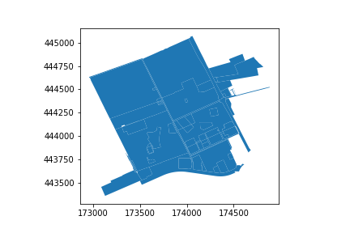
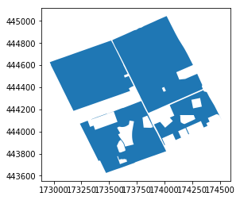
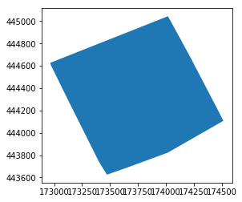

# [WUR Geoscripting](https://geoscripting-wur.github.io/) 

# Vector data handling with Python

_Jan Verbesselt, Jorge Mendes de Jesus, Aldo Bergsma, Dainius Masiliunas, David Swinkels, Corné Vreugdenhil_ - `r format(Sys.time(), '%Y-%m-%d')`

## Introduction

Good morning! Today we will have fun by exploring a variety of Python packages for vector data handling. A good package is [GeoPandas](http://geopandas.org/). GeoPandas strives to make vector processing in Python easier and has a lot of tools available for exploratory vector data analysis. It leverages several other popular Python packages:

* [Pandas](http://pandas.pydata.org/) for dataframes and data analysis
* [Shapely](http://toblerity.org/shapely/) for geometric operations
* [Fiona](http://toblerity.org/fiona/) for geodata access and conversions
* [pyproj](https://github.com/jswhit/pyproj) for re-projecting
* [matplotlib](https://matplotlib.org/) for plotting
* [psycopg2](https://pypi.org/project/psycopg2/) for PostgreSQL database connection 
* [GeoPy](https://geopy.readthedocs.io/en/stable/) for geocoding

By bundling the tools of these packages, GeoPandas provides powerful tools to perform spatial analysis in Python. Other packages, such as [Folium](https://python-visualization.github.io/folium/docs-v0.6.0/) and [OSMnx](https://osmnx.readthedocs.io/en/stable/), build on the GeoDataFrame capablities of GeoPandas. Fiona builds on GDAL/OGR packages to read and write data. GDAL/OGR/OSR are the backbone of spatial processing in Python and have high performance, but are not that intuitive to use. GeoPandas made it easier to perform spatial processing.

## Setting up the Python Environment
Before we continue with scripting, the Python environment needs to be setup. Let's use Conda for this. Check in Bash what environments are already available.

```{r, eval=FALSE,engine='bash'}
conda info --envs
```

We can use the existing 'geoscripting' environment. If you don't have this one yet, create quickly this one with the bash scripts below. this one installs a conda environment with all packages (and versions) that don't conflict with each other for this course.

```{r, eval=FALSE, engine='bash'}
wget https://raw.githubusercontent.com/GeoScripting-WUR/InstallLinuxScript/master/user/environment.yml
conda env create -f environment.yml
```

Most of the installed software were Python packages. One was not. Can you tell which one? 

It was the [Spyder IDE](https://docs.spyder-ide.org/)! Run the bash code below to setup your file system and to start Spyder. When Spyder is started in a terminal with an active conda environment, Spyder automatically uses the Python interpreter of the active conda environment. Make a new directory for your main script, other scripts and data with some bash code. Then start Spyder.

```{r, eval=FALSE,engine='bash'}
cd ~/Documents/
mkdir PythonVector #or give the directory a name to your liking
cd ./PythonVector
mkdir scripts
mkdir data
spyder
```

In Spyder you should see an editor, a file explorer and a console. Have a look at the toolbar. Some important shortcuts are:

* F5 to run your script
* CTRL + S to save your script
* CTRL + 1 to comment/uncomment your code
* TAB to indent your code
* SHIFT + TAB to unindent your code

Open a new file and save your Python script in the main directory you just made and name it main.py (File -- > New File --> Save As).

## Creating Geometries, GeoSeries and GeoDataFrames
Geometries in Python can be created and stored as a datatype by using Shapely. Shapely can create geometries and performs geometric operations. GeoPandas uses the geometries from Shapely to store geometries in GeoSeries and GeoDataFrames. Copy the code below in the Spyder Editor and press run (F5):

```{Python, eval=FALSE}
from shapely.geometry import Point
import geopandas as gpd
wageningenCampus = Point([173994.1578792833, 444133.60329471016])
print(type(wageningenCampus))
gs = gpd.GeoSeries([wageningenCampus])
print(type(gs), len(gs))
```

You just created a point in Shapely and a GeoSeries in GeoPandas. A GeoSeries is a vector (a column of values) where each value in the vector is a set of shapes corresponding to one observation. GeoPandas implements two main data structures, a GeoSeries and a GeoDataFrame. If you are familiar with Pandas, then know that these are subclasses of Pandas Series and DataFrame, respectively.

A GeoSeries is made up of an index and a GeoPandas geometry data type. This data type is a shapely.geometry object, and therefore inherits attributes and methods from shapely geometries, such as area, bounds, distance, etc. A GeoDataFrame is a tabular data structure with multiple columns that contains one column that is a GeoSeries.

GeoPandas has six classes of geometric objects, corresponding to the three basic single-entity geometric types and their associated homogeneous collections of multiple entities:

* Single entity (core, basic types):
    * Point
    * Line (formally known as a LineString)
    * Polygon
* Homogeneous entity collections:
    * Multi-Point
    * Multi-Line (MultiLineString)
    * Multi-Polygon

The geometries are represented in WKT strings. WKT ([Well Known Text](https://en.wikipedia.org/wiki/Well-known_text)) is a markup language that describes spatial information in a clean text format, there is an equivalent in binary format called WKB (easier for computers to process and more efficient for data transfer). Printing geometries of GeoSeries also shows the WKT string.

```{Python, eval=FALSE}
from shapely.wkt import loads
WKTstring = 'POINT(173994.1578792833 444133.6032947102)'
gs = gpd.GeoSeries([loads(WKTstring)])
gs.crs = {'init': 'epsg:28992'}
gsBuffer = gs.buffer(100)
print(gs.geometry)
print(gsBuffer.geometry)
```

```{block, type="alert alert-success"}
> **Question 1**: What does WKB mean? (hint: think about WKT)
```

GeoDataFrames can be loaded from a file, created with data or loaded from a Pandas dataframe. A Pandas DataFrame is the dataframe equivalent of R in Python. 

```{Python, eval=FALSE}
import pandas as pd
data = {'name': ['a', 'b', 'c'],
        'x': [173994.1578792833, 173974.1578792833, 173910.1578792833],
        'y': [444135.6032947102, 444186.6032947102, 444111.6032947102]}
df = pd.DataFrame(data)
print(df.head)
```

If a Pandas dataframe has two columns filled with coordinate pairs, then these columns can be converted to a list of Point geometries and can then be converted into a GeoSeries or directly to a GeoDataFrame.

```{Python, eval=FALSE}
geometry = [Point(xy) for xy in zip(df['x'], df['y'])]
wageningenGDF = gpd.GeoDataFrame(df, geometry=geometry)
wageningenGDF.crs = {'init': 'epsg:28992'}
wageningenGDF.plot(marker='*', color='green', markersize=50)
print(type(wageningenGDF), len(wageningenGDF))
```


```{block, type="alert alert-success"}
> **Question 2**: What is the difference between a GeoSeries and a GeoDataFrame?
```

## Geocoding

Geocoding is the practice of locating the coordinates of addresses, cities, countries, and landmarks across the globe. Python has GeoPy to perform geocoding. GeoPy has a lot of [geocoders available](https://geopy.readthedocs.io/en/stable/) from Bing, Google, HERE, TomTom, MapBox and others. Often you need to have an API key to use the geocoders, which is used by the provider to limit the amount of requests to be able to keep the geocoding service running for everyone. Some geocoders are publicly available, such as Nominatim. Nominatim is made and used by OpenStreetMap. Paste the code below in Spyder and run the geocoder:

```{Python, eval=FALSE}
from geopy.geocoders import Nominatim
geolocator = Nominatim(user_agent="specify_random_user_agent")
location = geolocator.geocode("Wageningen University")
print((location.latitude, location.longitude))
# It should print two coordinates: (lat: 51.98527485, lon:5.66370505205543)
```

Try to locate the coordinates of your own house.

## Re-projecting

From the geocoder you got a latitude and longitude. On the web it is very common to use latitude and longitude in [WGS84 geographic coordinate system](http://spatialreference.org/ref/epsg/wgs-84). In local projects often projected coordinate systems are required to perform accurate geometric calculations. PyProj reprojects your coordinates from any input projection to an output projection. Use PyProj to do a simple conversion on a coordinate pair:

```{Python, eval=FALSE}
from pyproj import Proj, transform
geolocator = Nominatim(user_agent="specify_random_user_agent")
location = geolocator.geocode("Wageningen University")
inProj = Proj(init='epsg:4326') #WGS84
outProj = Proj(init='epsg:28992') #RD New
x, y = transform(inProj, outProj, location.longitude, location.latitude)
print([x, y])
```

GeoPandas uses PyProj on the backend to reproject geometry columns of the dataframe. Reproject your GeoDataFrame from Dutch RD New (EPSG:28992) to WGS84 (EPSG:4326):

```{Python, eval=FALSE}
data = {'name': ['a', 'b', 'c'],
        'x': [173994.1578792833, 173974.1578792833, 173910.1578792833],
        'y': [444135.6032947102, 444186.6032947102, 444111.6032947102]}
df = pd.DataFrame(data)
geometry = [Point(xy) for xy in zip(df['x'], df['y'])]
wageningenGDF = gpd.GeoDataFrame(df, geometry=geometry)
print(wageningenGDF.crs)
wageningenGDF.crs = {'init': 'epsg:28992'}
print(wageningenGDF.crs)
wageningenGDF = wageningenGDF.to_crs({'init': 'epsg:4326'})
print(wageningenGDF.crs)
```

## Writing and Reading Files

GeoPandas uses Fiona for file access. You can find out what file formats Fiona supports with a simple script.

```{Python, eval=FALSE}
import fiona
print(fiona.supported_drivers)
```

Fiona has drivers for:

* Open formats such as GeoJSON and GPX
* ESRI formats such as shapefiles and OpenFileGDB
* Other formats such as MapInfo and DGN

But Fiona lacks some other popular file formats:

* Open formats such as [KML](https://github.com/Toblerity/Fiona/issues/97) or [GML](https://github.com/Toblerity/Fiona/pull/96) based on the XML format. Solution: [xml.etree.ElementTree](https://docs.python.org/3/library/xml.etree.elementtree.html).
* Databases such as PostgreSQL. Solution: [psycopg2](https://pypi.org/project/psycopg2/).
* Webservices such as Web Feature Service [WFS] or Web Map Service [WMS]. Solution: [OWSLib](https://geopython.github.io/OWSLib/).
* Columnar formats, such as CSV or xls. Solution: Pandas can read [csv](https://pandas.pydata.org/pandas-docs/stable/generated/pandas.read_csv.html) or [excel](https://pandas.pydata.org/pandas-docs/stable/generated/pandas.read_excel.html) columns.

If none of these packages are helpful to access your files, [OGR might still be able to help](http://www.gdal.org/ogr_formats.html).

A GeoDataFrame can be written directly to a GeoJSON file or a shapefile. [GeoJSON is a recommended format](http://switchfromshapefile.org/) to use for geographic data in WGS84 coordinate system since JSON dictionaries are easy to read and use on the web, and GeoJSON is supported in popular GIS software. [GeoJSON](http://geojson.org/) is a standard format to encode Geographic data structures in a dictionary. We assume that you are working in the main repository in which you have a data repository. Write some files to a GeoJSON and shapefile:

```{Python, eval=FALSE}
data = {'name': ['a', 'b', 'c'],
        'x': [173994.1578792833, 173974.1578792833, 173910.1578792833],
        'y': [444135.6032947102, 444186.6032947102, 444111.6032947102]}
df = pd.DataFrame(data)
geometry = [Point(xy) for xy in zip(df['x'], df['y'])]
wageningenGDF = gpd.GeoDataFrame(df, geometry=geometry)
wageningenGDF.to_file(filename='./data/wageningenPOI.geojson', driver='GeoJSON')
wageningenGDF.to_file(filename='./data/wageningenPOI.shp', driver='ESRI Shapefile')
```

Reading files is just as intuitive:

```{Python, eval=FALSE}
jsonGDF = gpd.read_file('./data/wageningenPOI.geojson')
shpGDF = gpd.read_file('./data/wageningenPOI.shp')
```

## Reading from Web Services

The web has a lot of geodata available. The OpenGeoSpatial Consortium has specified standard protocols for geo web services, such as [Web Feature Service](http://www.opengeospatial.org/standards/wfs) [WFS] and [Web Map Service](http://www.opengeospatial.org/standards/wms) [WMS]. The standard web service protocols make it easy to access all types of data with the same protocol.

```{Python, eval=FALSE}
from owslib.wfs import WebFeatureService
WfsUrl = 'https://geodata.nationaalgeoregister.nl/nwbwegen/wfs?'
wfs = WebFeatureService(url=WfsUrl, version='2.0.0')
wfs.identification.title
print(list(wfs.contents))
```

This WFS provides geodata on roads and is extracted from the Dutch national database of roads in the Netherlands.

WFS are useful to make webmaps, to quickly get an idea of the data and to make geodata accessible for all. If you want to do a large analysis, it is better to download the geodata from other available repositories and not from a WFS. Web Feature Services have limits on the amount of features that can be requested, such as 100 or 1000 features. In this case they are very generous with providing a limit of max 15.000 features per request.

Load some roads from the WFS service for the campus area and plot it.

```{Python, eval=FALSE}
import json
# x, y = (173994.1578792833, 444133.60329471016) #uncomment if you lost x, y coordinates or Nominatim didn't work above :D
WfsUrl = 'https://geodata.nationaalgeoregister.nl/nwbwegen/wfs?'
wfs = WebFeatureService(url=WfsUrl, version='2.0.0')
layer = list(wfs.contents)[0]
xmin, xmax, ymin, ymax = x-1000, x+350, y-1000, y+350
response = wfs.getfeature(typename=layer, bbox=(xmin, ymin, xmax, ymax))
with open('./data/Roads.gml', 'wb') as file:
    file.write(response.read())
roadsGDF = gpd.read_file('./data/Roads.gml')
print(type(roadsGDF))
roadsGDF.plot()
```


How many roads are there in the resulting GeoDataFrame (hint: _len()_ or _.info()_)? Do we miss roads in the extent? 

Load some building from another WFS service (BAG) and plot them too. How many buildings do you get? (hint: _len()_) Do you miss buildings? How can we extract missing buildings in our extent? 

```{Python, eval=FALSE}
WfsUrl = 'https://geodata.nationaalgeoregister.nl/bag/wfs?'
wfs = WebFeatureService(url=WfsUrl, version='2.0.0')
layer = list(wfs.contents)[1]
xmin, xmax, ymin, ymax = x-1000, x+1000, y-1000, y+1000
response = wfs.getfeature(typename=layer, bbox=(xmin, ymin, xmax, ymax), outputFormat='application/gml+xml; version=3.2')
with open('./data/Buildings.gml', 'w') as file:
    file.write(response.read())
BuildingsGDF = gpd.read_file('./data/Buildings.gml')
print(type(BuildingsGDF))
roadlayer = roadsGDF.plot(color='grey')
roadlayer.set_xlim(xmin, xmax)
roadlayer.set_ylim(ymin, ymax)
BuildingsGDF.plot(ax=roadlayer, color='red')
```


Let us also load the administrative parcels for this area.

```{Python, eval=FALSE}
parcelsWFSUrl = 'https://geodata.nationaalgeoregister.nl/kadastralekaartv3/wfs'
parcelsWFS = WebFeatureService(url=parcelsWFSUrl, version='2.0.0')
print(list(parcelsWFS.contents))

responseParcels = parcelsWFS.getfeature(typename='kadastralekaartv3:perceel', 
                                        bbox=(xmin, ymin, xmax, ymax), 
                                        maxfeatures=100, outputFormat='json', startindex=0)
data = json.loads(responseParcels.read())
parcelsGDF = gpd.GeoDataFrame.from_features(data['features'])
parcelsGDF.plot()
```



## Selecting Data

GeoDataFrames store rows and columns in a tabular format. To select specific rows, you can make use of the DataFrame functionality of Pandas. Inspect the content of your data:

```{Python, eval=FALSE}
print(parcelsGDF.columns)
print(parcelsGDF.head())
print(parcelsGDF.area)
```

Then based on the surface area, select parcels with a larger surface area of 100,000 m2 with the .loc method. This is equivalent to selecting rows.

```{Python, eval=FALSE}
print(parcelsGDF.area > 100000)
largeParcelsGDF = parcelsGDF.loc[parcelsGDF.area > 100000]
largeParcelsGDF.plot()
```

Columns can be selected by using an index to the name of the column.

```{Python, eval=FALSE}
print(parcelsGDF['perceelnummer'])
```

Specific rows can be selected by using .isin method on a series.

```{Python, eval=FALSE}
print(parcelsGDF['perceelnummer'].isin(['11185', '11725']))
campusParcelsGDF = parcelsGDF[parcelsGDF['perceelnummer'].isin(['11185', '11725'])]
campusParcelsGDF.plot()
```


## Geometric Manipulations

GeoDataFrames and GeoSeries have several [constructive methods](http://geopandas.org/geometric_manipulations.html) to modify the geometry: buffer, boundary, centroid, convex hull, envelope, simplify, unary union, rotate, scale, skew and translate. When modifying the geometries in the DataFrames, it is a good practice to keep track of your geometry types and your geometry data. Have a look at the geometry types.

```{Python, eval=FALSE}
print(type(largeParcelsGDF))
print(type(largeParcelsGDF.geometry))
print(type(largeParcelsGDF['geometry']))
```

Bind some parcels together with a union.
```{Python, eval=FALSE}
parcelsUnionGS = gpd.GeoSeries(largeParcelsGDF.unary_union)
parcelsUnionGS.plot()
```



```{block, type="alert alert-success"}
> **Question 3**: What is the geometry type of geometries in parcelsUnionGS?
```

```{block, type="alert alert-success"}
> **Question 4**: What coordinate system does parcelsUnionGS have?
```

There is still some holes between the parcels. Create a convex around the merged features.
```{Python, eval=FALSE}
parcelsConvexGDF = gpd.GeoDataFrame(parcelsUnionGS.convex_hull)
parcelsConvexGDF = parcelsConvexGDF.rename(columns={0:'geometry'}).set_geometry('geometry')
parcelsConvexGDF.plot()
```



GeoPandas can perform different [overlay operations](http://geopandas.org/set_operations.html): intersection, union, symmetrical difference and difference. Clip the roads with convexed parcels by using intersection.
```{Python, eval=FALSE}
# we need polygons instead of line features for the overlay
RoadsPolygonGDF = gpd.GeoDataFrame(roadsGDF, geometry=roadsGDF.buffer(distance=5))
RoadsPolygonGDF.plot()
# perform an intersection overlay
roadsIntersectionGDF = gpd.overlay(parcelsConvexGDF, RoadsPolygonGDF, how="intersection")
roadsIntersectionGDF.plot()
```


The big advantage of GeoPandas is that GeoPandas allows both geometric and dataframe manipulations. For example, GeoPandas can select the roads within (and maintained by) Wageningen Municipality and calculate total road surface area.

```{Python, eval=FALSE}
WageningenRoadsGDF = RoadsPolygonGDF.loc[RoadsPolygonGDF['gme_naam']=='Wageningen']
print(sum(WageningenRoadsGDF.area))
WageningenRoadsGDF.plot()
```


## Visualizing spatial information

There are multiple solutions to visualize your geodata: GIS software (QGIS), web platforms (leaflet/Folium) and images (matplotlib). 

Folium uses leaflet on the backend to make webmaps. With leaflet your geodata can be easily visualized inside a webpage. [Leaflet](https://leafletjs.com/) is the leading open-source JavaScript library for mobile-friendly interactive maps. Folium handles GeoDataFrames or JSON files as input for the interactive map. The Python script below makes a .html file in your working directory, which you can open in your preferred web browser: 

```{Python, eval=FALSE}
import folium
campusMap = folium.Map([location.latitude, location.longitude], zoom_start=17)
BuildingsGDF.crs = {'init': 'epsg:28992'}
BuildingsGDF.to_crs({'init': 'epsg:4326'})
RoadsPolygonGDF.crs = {'init': 'epsg:28992'}
RoadsPolygonGDF.to_crs({'init': 'epsg:4326'})
campusMap.choropleth(BuildingsGDF, name='Building construction years', 
                     data=BuildingsGDF, columns=['gml_id', 'bouwjaar'], 
                     key_on='feature.properties.gml_id', fill_color='RdYlGn',
                     fill_opacity=0.7, line_opacity=0.2,legend_name='Construction year')
campusMap.choropleth(RoadsPolygonGDF)
folium.LayerControl().add_to(campusMap)
campusMap.save('./output/campusMap.html')
campusMap
```


Matplotlib allows you to make good quality maps for reports or publications.

```{Python, eval=FALSE}

## check code below critically, we request from wfs without storing a gml file!
import geopandas as gpd
from requests import Request
from owslib.wfs import WebFeatureService
from matplotlib import pyplot as plt
# extract only buildings on and around WUR campus
url = 'https://geodata.nationaalgeoregister.nl/bag/wfs'
layer = 'bag:pand'
# speciy the boundary box for extracting
xmin, xmax, ymin, ymax = x-300, x+600, y-300, y+300
bb = (xmin, ymin, xmax, ymax)
bb = ','.join(map(str, bb)) # string needed for the request
# Specify the parameters for fetching the data
params = dict(service='WFS', version="2.0.0", request='GetFeature',
      typeName=layer, outputFormat='text/xml; subtype=gml/3.2',
      srsname='urn:ogc:def:crs:EPSG::28992', bbox=bb)
# Parse the URL with parameters
q = Request('GET', url, params=params).prepare().url
# Read data from URL
BuildingsGDF = gpd.read_file(q)

# create visualisation
f, ax = plt.subplots(1, figsize=(10, 5))
ax.set_title('WUR campus buildings')
ax.set_facecolor("grey")
roadlayer = RoadsPolygonGDF.plot(ax=ax, legend=True)
roadlayer.set_xlim(xmin, xmax)
roadlayer.set_ylim(ymin, ymax)
buildingslayer = BuildingsGDF.plot(ax=roadlayer, column='bouwjaar', 
                                   cmap='brg', #see https://matplotlib.org/3.1.0/tutorials/colors/colormaps.html
                                   legend=True, 
                                   legend_kwds={'label': "Construction year",'orientation': "vertical"})
```


## Network analysis

There are a lot of Python packages available to help you with your specific spatial analysis. One package, that we could not leave out is OSMnx. [OSMnx](https://osmnx.readthedocs.io/en/stable/) retrieves, constructs, analyzes and visualizes street networks from [OpenStreetMap](https://www.openstreetmap.org/search?query=Wageningen%20university#map=18/51.98528/5.66368). In short, a network analysis is quite often performed with Open Street Map data since it is globally available, has well connected networks and has multiple travel modes (walking, cycling, driving et cetera). Download the street network of Wageningen and plot it.

```{Python, eval=FALSE}
import osmnx as ox
city = ox.gdf_from_place('Wageningen, Netherlands')
ox.plot_shape(ox.project_gdf(city))
WageningenRoadsGraph = ox.graph_from_place('Wageningen, Netherlands', network_type='all')
ox.plot_graph(WageningenRoadsGraph, fig_height=20, fig_width=20)
ox.save_graph_shapefile(G=WageningenRoadsGraph, filename='OSMnetwork_Wageningen.shp')
gdf_nodes, gdf_edges = ox.graph_to_gdfs(G=WageningenRoadsGraph)
print(gdf_nodes.info())
print(gdf_edges.info())
```


OSMnx can store the downloaded street network (the Graph) as a shapefile or as a GeoDataFrame. Furthermore, the main purpose is to perform a network analysis, such as a shortest path from source to target location. Let us calculate the shortest path from Wageningen campus to Wageningen city center. Is this the route you would take?

```{Python, eval=FALSE}
source = ox.get_nearest_node(WageningenRoadsGraph, (51.987817, 5.665779))
target = ox.get_nearest_node(WageningenRoadsGraph, (51.964870, 5.662409))
shortestroute = ox.nx.shortest_path(G=WageningenRoadsGraph, 
                                    source=source, target=target, weight='length')
ox.plot_graph_route(WageningenRoadsGraph, shortestroute, 
                    fig_height=20, fig_width=20)
```


# What have we learned?

1. Creating geometries, GeoSeries and GeoDataFrames
2. Geocoding
3. Re-projecting
4. Reading and writing data
5. Reading webservices
6. Selecting data
7. Geometric manipulations
8. Geo-visualization
9. Network analysis

